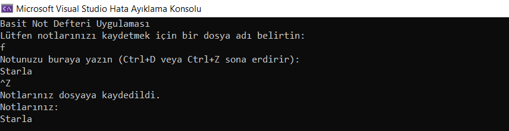

# Basit-Not-Defteri-Uygulamas-
Bu C++ programı, kullanıcının bir dosyaya notlar yazmasına ve bu notları daha sonra okumasına olanak tanıyan basit bir not defteri uygulamasını temsil eder.

# `Notepad` Sınıfı
- `Notepad` sınıfı, not defteri uygulamasını temsil eder ve notları bir dosyaya kaydetme ve okuma işlemlerini gerçekleştirir.
- `writeNote` fonksiyonu, kullanıcıdan notları alır ve notes vektörüne ekler. Kullanıcı *Ctrl+D* veya *Ctrl+Z* kombinasyonunu kullanarak not girişini sonlandırabilir.
- `saveNote` fonksiyonu, `notes` vektöründeki notları belirtilen dosyaya kaydeder.
- `readNote` fonksiyonu, belirtilen dosyadaki notları okur ve ekrana yazdırır.

  # `main` Fonksiyonu
  - `main` fonksiyonu, programın ana kontrol akışını sağlar.
  - Kullanıcıdan bir dosya adı alınır ve bu adla bir `Notepad` nesnesi oluşturulur.
  - Kullanıcıya notlarını girmesi için bir mesaj gösterilir ve `writeNote` fonksiyonu çağrılır.
  - `saveNote` fonksiyonu çağrılarak notlar dosyaya kaydedilir.
  - `readNote` fonksiyonu çağrılarak notlar dosyadan okunur ve ekrana yazdırılır.

# Türkçe Karakter Desteği
- `setlocale(LC_ALL, "Turkish");` ifadesi ile Türkçe karakter desteği sağlanır.

# Örnek Kullanım
- Kullanıcı, programı başlattığında bir dosya adı belirtmesi istenir.
- Kullanıcı, notlarını girmek için bir mesaj alır ve *Ctrl+D* veya *Ctrl+Z* tuş kombinasyonu kullanılarak not girişini sonlandırabilir.
- Notlar belirtilen dosyaya kaydedilir ve ardından okunarak ekrana yazdırılır.
  
**Bu örnek, basit bir not defteri uygulamasını temsil eder ve kullanıcıdan alınan notları dosyaya kaydedip daha sonra okuma işlemini gerçekleştirir.**

# Ekran Resmi

# Bilgilendirme
**---------------------------------------------------------**
| Herkese Açık | Geliştirilebilir | Zyra Software|
|---------|---------|---------|
| Açık | Geliştirilebilir |@zyrasoftware |
